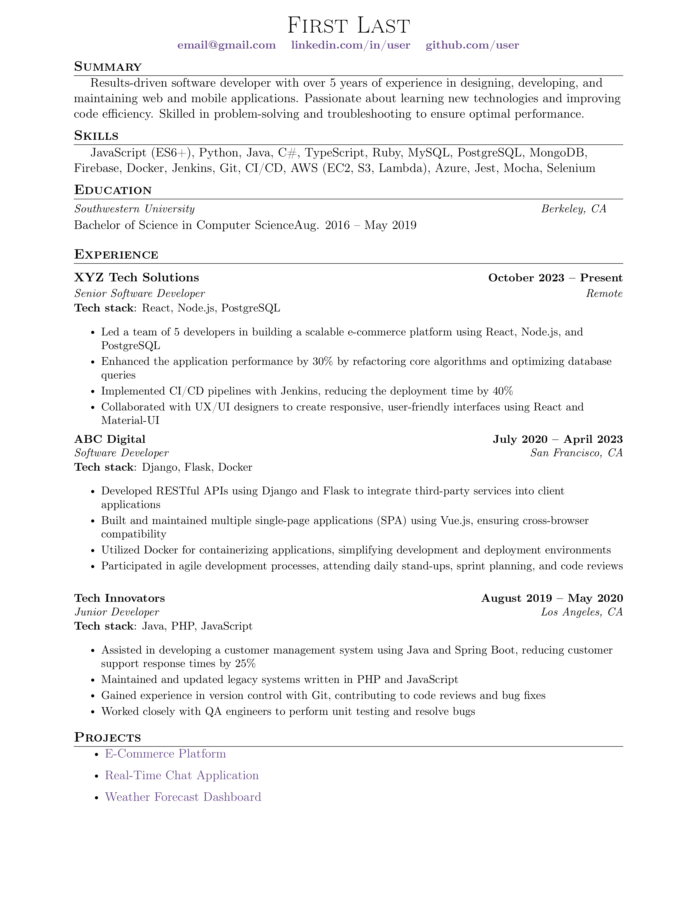

<h1 align="center">
  LaTeX resume template
</h1>

<hr>

<p align="center">
  <a href="#">Overleaf</a> •
  <a href="#note">Note</a> •
  <a href="#description">Description</a> •
  <a href="#local-build">Local build</a> •
  <a href="#preview">Preview</a> •
  <a href="#license">License</a>
</p>

## Note
This LaTeX template is a reworked version of the template by [Jake Gutierrez](https://github.com/jakegut), 
which is available on GitHub via [this link](https://github.com/jakegut/resume). 
The original template is licensed under the [MIT License](https://github.com/jakegut/resume/blob/master/LICENSE).

## Description
Yet another simple, clean, and ATS-friendly resume template with a modular structure.
It also supports local building of the PDF from `.tex` files using Docker,
and includes a simple CI pipeline that builds the PDF using GitHub Actions.


## Local build
To see available `just` commands, run:
```bash
just help
```

<details>
<summary>Useful commands</summary>

Build the image:
```bash
just build
```

Convert `.tex` to `.pdf`:
```bash
just run
```

Format `.tex` files and build the PDF:
```bash
just run-format
```

Remove all `.bak` files:
```bash
just remove-bak
```

Run LaTeX linter:
```bash
just run-linter
```
</details>

## Preview


## License
This project is licensed under the MIT License. For more details, see the [LICENSE](./LICENSE) file.

<br>
<p align="center">
  <a href="https://github.com/mrKazzila">GitHub</a> •
  <a href="https://mrkazzila.com">Resume</a> •
  <a href="https://www.linkedin.com/in/i-kazakov/">LinkedIn</a>
</p>
